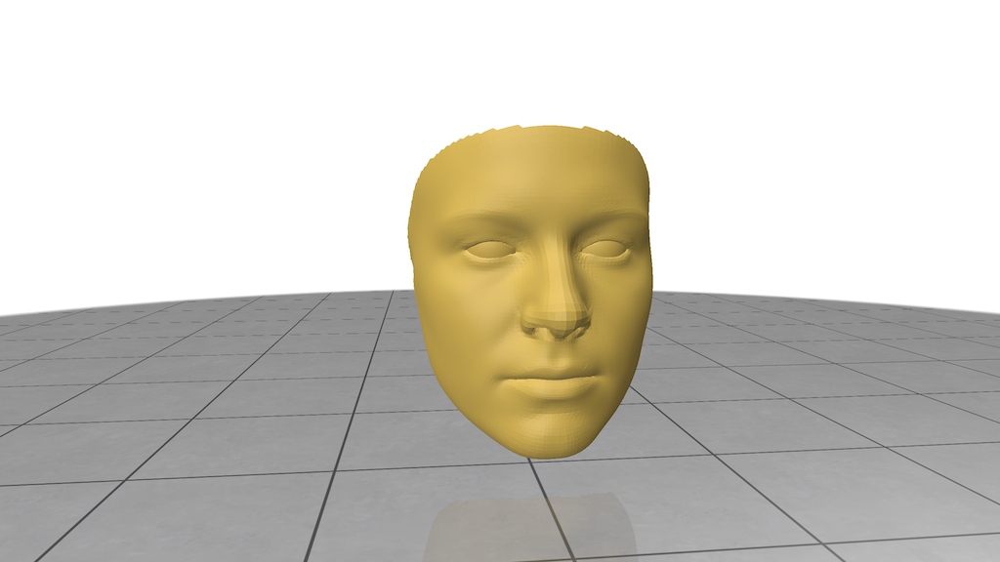
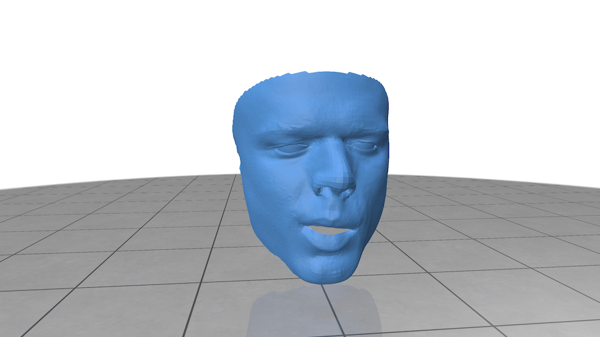
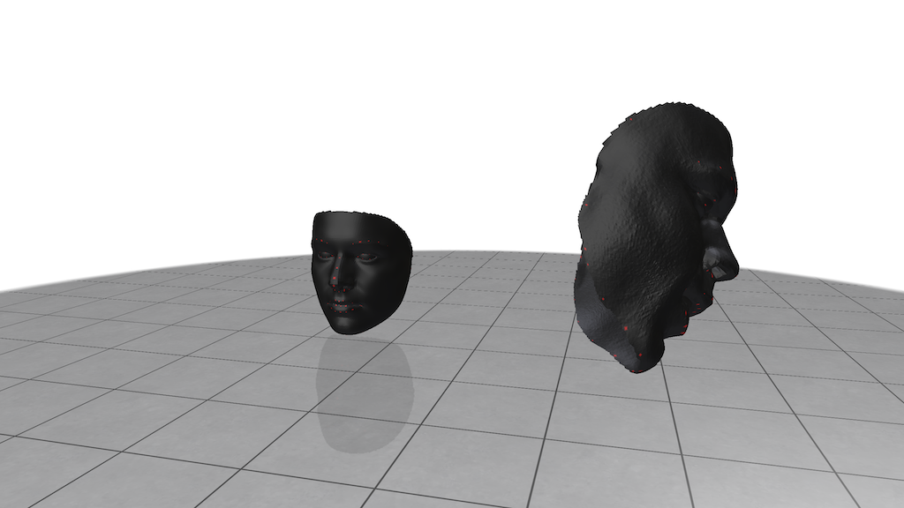
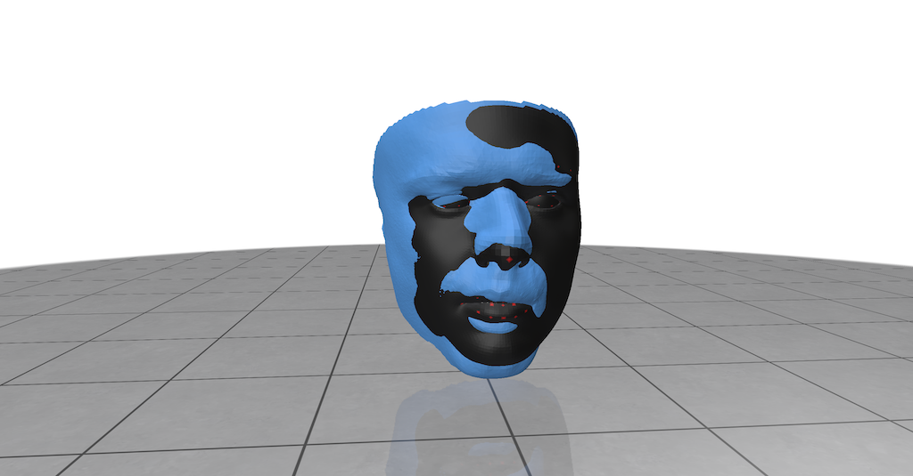
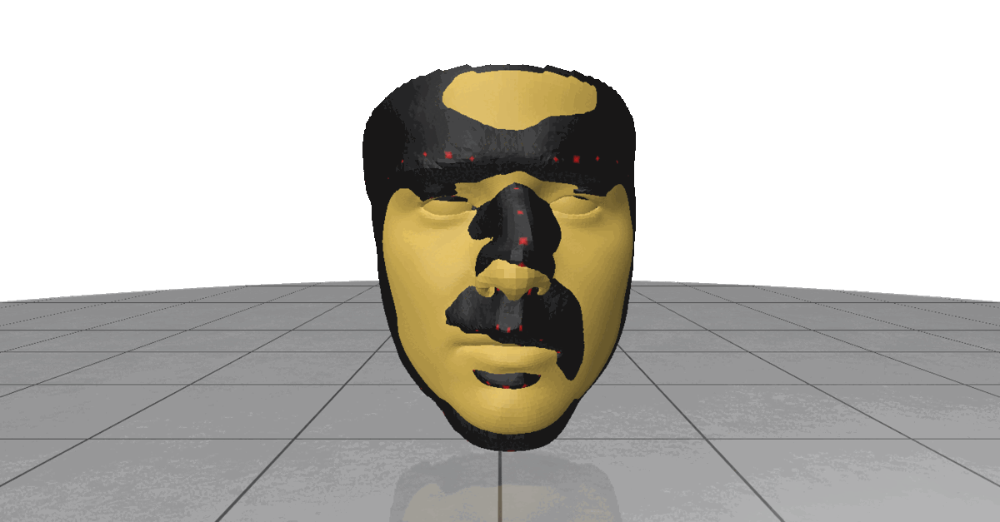
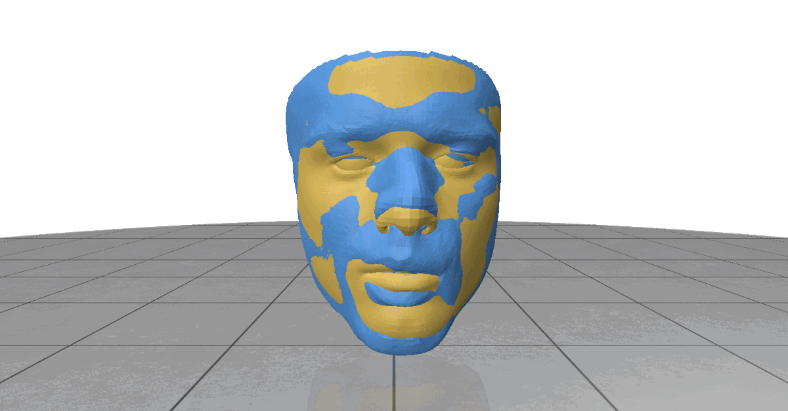
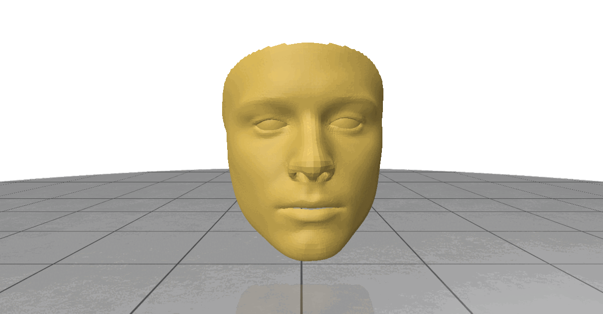
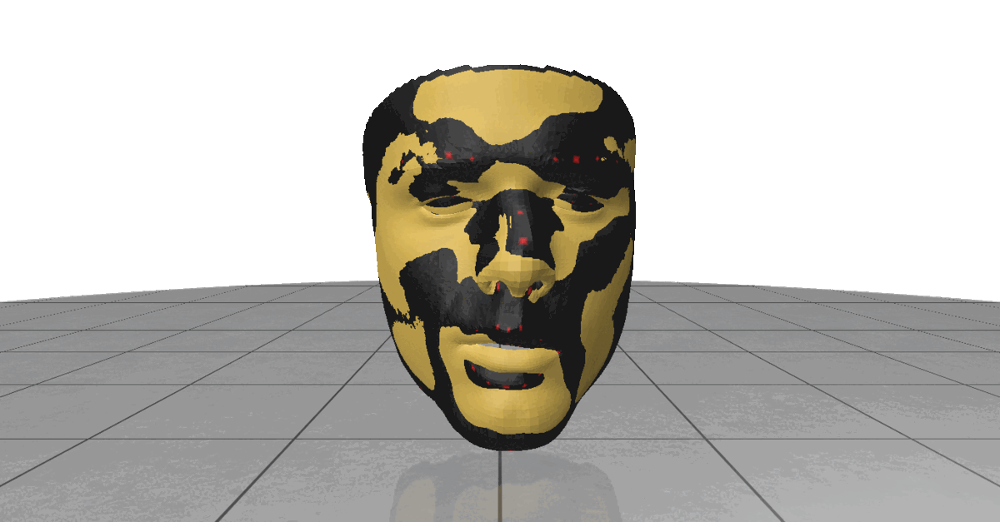
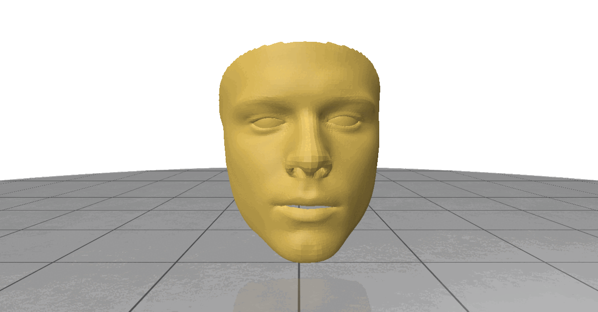

# 3D Morphable Face Model

In this exercise, you will learn how to align a 3D Morphable Model (3DMM) to a 3D face scan using the Iterative Closest Point (ICP) and Gauss-Newton optimization algorithms.

The objective of this exercise is to minimize the difference between the model and the face scan, so that the morphable model accurately represents the face scan. The four graded tasks in this exercise are designed to test your understanding of different aspects of the alignment process. These tasks are:

1. __Shape matching__: Align the 3DMM to the face scan using procrustes analysis.
2. __Rigid ICP__: Perform rigid ICP alignment between the 3DMM and the face scan.
3. __Non-Rigid ICP__: Perform non-rigid ICP alignment between the morphable model and the face scan.
4. __(Bonus) Point-to-Plane optimization__: Implement the Point-to-Plane optimization technique to further improve the alignment results.

## Init
3D Morphable Model (3DMM) is a statistical model of the human face. It is a 3D shape model that can be used to represent a face in a compact form. The 3DMM is composed of a mean shape, a set of principal components (blend shapes).

In this homework we will use a very well known Basel Face Model (BFM). The BFM is a 3DMM that is trained on a large dataset of 3D face scans. The BFM is available for download from the [BFM website](faces.dmi.unibas.ch/bfm/bfm2017.html).

For your convenience, we have already downloaded the BFM model (you will download it when import the modules below). By downloading the BFM model, you agree to the terms of the [license](faces.dmi.unibas.ch/bfm/bfm2017.html). The BFM is represented as a BFM_layer class defined in BFM.py.

BFM model |  Scan
:-------------------------:|:-------------------------:
 |   

**Problem**: The BFM model is not aligned with the face scan. We need to align (or "fit") the BFM model to the face scan using the Iterative Closest Point (ICP) and Gauss-Newton optimization algorithms. First we align it in a non-rigid way, then we will use the Point-to-Plane (or Point-to-Surface – bonus) optimization technique to further improve the alignment results.

 

## Task 1: Rigid shape matching
On the image above you can notice red marks on the face scan and on the BFM model. These are the keypoints that we will use to align the two meshes. We will use them to align the two meshes.

The sparse set of keypoints in the scan and in the BFM model are used to perform rigid shape matching. Rigid matching is a simple but effective way to align two meshes. The idea is to find the rigid transformation that minimizes the difference between the two set of keypoints (defined on each mesh). 

The difference between the two meshes is measured by the sum of the squared distances between the corresponding keypoints.

Thus you need to find the rigid transformation that minimizes the following objective function:

$$\min_{R, t} \sum_{i=1}^{n} \| p_i \cdot R  * s + t - q_i \|^2_2$$

where $p_i$ and $q_i$ are the $i$-th keypoints in the scan and in the BFM model, respectively. The correspondence between them is known and fixed. $R$ is the rotation matrix, $t$ is the translation vector and $s$ is scale values (scalar).

__Note__: here we transform the scan (while the BFM model is fixed) to the BFM model. In the following tasks, we will fit the BFM model to the scan.

__Task1__: Implement the `rigid_matching` function in `fitting_3DMM.py` to find the rigid transformation that aligns the scan to the BFM model. The function should return the transformation matrix.

 

## Task 2: Rigid ICP

After the rigid shape matching step we have a good initial guess for the rigid transformation. Now we will use the ICP algorithm to refine the rigid alignment.

The ICP algorithm is an iterative algorithm that minimizes the difference between the two meshes. The difference between the two meshes is measured by the sum of the squared distances between the corresponding points. The ICP algorithm is composed of two steps:

1. __Closest point matching__: For each point in the BFM model find the closest point in the scan (correspondence).
2. __Rigid transformation estimation__: Estimate the rigid transformation that minimizes the difference between the found correspondences.

The estimation of the rigid transformation is done by solving the following optimization problem:

$$
\min_{R, t} \sum_{i=1}^{n} \| q_i \cdot R + t - p_i \|^2_2
$$

where $p_i$ and $q_i$ are the $i$-th closest points in the scan and in the BFM model, respectively. $R$ is the rotation matrix, $t$ is the translation vector. 

__Task 2__: Implement the function `rigid_ICP` in the `fitting_3DMM.py` file.

<!--   -->
 

## Task 3: Non-Rigid Fitting

The 3DMM model is a way to represent a face in a compact form. The 3DMM model is composed of a mean shape, a set of identity blend shapes and expression blend shapes. The 3DMM model can be represented as:

$$
\hat{q}_{\alpha, \beta} = \mu + \sum_{i=1}^{k} \alpha_i \cdot \phi_i + \sum_{j=1}^{l} \beta_j \cdot \psi_j
$$

where $\mu$ is the mean shape, 

$\phi_i$ are the $i$-th (identity) principal component $\alpha_i$ are the $i$-th principal components coefficient. This deformation represents the identity changes (id)

$\psi_j$ are the $j$-th (expression) principal component and $\beta_j$ are the $j$-th principal component coefficient. This deformation represents the expression changes (exp)

Correspondence between the code and the math:

$\mu$ == `bfm_model.mean_shape`

$\phi_i$ == `bfm_model.id_base[:, i]`

$\alpha_i$ == `bfm_model.id_coeff[i]`

$\psi_j$ == `bfm_model.exp_base[:, j]`

$\beta_j$ == `bfm_model.exp_coeff[j]`

You can check if your implementation of BFM is correct by running the following code (the sample function is BFM_layer.inference):

```python tests.py::test_bfm_sample```

You can play with the coefficients to see how the face changes.

```
import numpy as np
import polyscope as ps
from utils load_bfm


bfm_model = load_bfm()

bfm_model.id_coeff = np.random.randn(80) #< Set the identity coefficients randomly
bfm_model.exp_coeff = np.random.randn(64) #< Set the expression coefficients randomly

# Visualize the sampled face
ps.init()
vis_mesh_ps(
    bfm_model.inference(),
    bfm_model.faces,
    name="BFM random")
ps.show()
```


Now that we have a rigidly aligned mesh (after Task2), we can use the non-rigid fitting to deform the mesh to match the scan. The non-rigid fitting is done by minimizing the difference between the two meshes. The difference between the two meshes is measured by the sum of the squared distances between the corresponding points. The non-rigid fitting is composed of two steps:

1. __Closest point matching__: For each point in the BFM model find the closest point in the scan (correspondence).
2. __Non-Rigid transformation estimation__: Estimate the non-rigid transformation that minimizes the difference between the found correspondences.

The estimation of the non-rigid transformation is done by solving the following optimization problem:

$$
\begin{align}
\min_{\alpha, \beta, R, t} \sum_{i=1}^{n} \| (\hat{q}_{\alpha, \beta})_i \cdot R + t - p_i \|^2_2
\end{align}
$$

To ease the computation of derivatives, the rotation is inversed and the objective function is reformulated as follows:

$$
\begin{align}
\min_{\alpha, \beta, R, t} \sum_{i=1}^{n} \| (\hat{q}_{\alpha, \beta})_i + t \cdot R^T - p_i \cdot R^T \|^2_2
\end{align}
$$

where $p_i$ and $(\hat{q}_{\alpha, \beta})_i$ are the $i$-th closest points in the scan and in the BFM model, respectively. $\alpha$ and $\beta$ are the non-rigid parameters, n - number of correspondences

The non-rigid fitting is done by minimizing the objective function above. The optimization is done by using the Gauss-Newton algorithm.

__NOTE__: Jacobians for rotation and translation should be modified to account for the rotation inversion. That modification is done for you (special_mode flag). If the Jacobians are correct for the rigid ICP, here they'll work without any change.


Scan & BFM Overlay | BFM
:-------------------------:|:-------------------------:|
 |   |   

__Task 3__: Implement the function `non_rigid_fitting` in the `fitting_3DMM.py` file.

## Task 4: Point-to-Plane ICP

You may have noticed that the functions `non_rigid_fitting` and `rigid_ICP` in the `fitting_3DMM.py` file also have a `loss_type` parameter. This parameter can be either `Point2Point` or `Point2Plane`. The `Point2Point` loss is the one we used in the previous tasks (by default). The `Point2Plane` loss is a more advanced loss that is more robust to outliers. It is defined as:

$$
\min_{\alpha, \beta, R, t} \sum_{i=1}^{n} ( ( (\hat{q}_{\alpha, \beta})_i + t \cdot R^T - p_i \cdot R^T) \cdot N_i )^2 
$$

where $p_i$ and $(\hat{q}_{\alpha, \beta})_i$ are the $i$-th closest points in the scan and in the BFM model, respectively. $\alpha$ and $\beta$ are the non-rigid parameters. $N$ is the normal of the Plane that corresponds to the scan vertex $p_i$.


__Task 4__: Implement the `loss_type=Point2Plane` method in the `non_rigid_fitting` and `rigid_ICP` functions in `fitting_3DMM.py` file.


Scan & BFM Overlay | BFM
:-------------------------:|:-------------------------:|
 |   |   
